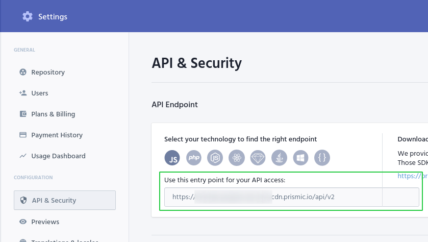

<h1 align="center">
  
</h1>

## :rocket: Tecnologias

Esse projeto foi desenvolvido com as seguintes tecnologias:
- [React](https://reactjs.org/)
- [Next](https://nextjs.org/)
- [Typescript](https://www.typescriptlang.org/)
- [SCSS](https://sass-lang.com/)
- [Utteranc](https://utteranc.es/)
- [date-fns](https://date-fns.org/)

### CMS

- [Prismic](https://prismic.io/)

## :computer: Projeto
Desafio realizado durante o Ignite que consiste em criar uma aplicação de um blog com Prismic CMS a partir de um layout do Figma. Spacetraveling consiste em uma aplicação de um blog para notícias, onde é possivel navegar entre elas pela pagina inicial, ou pela paginação de cada post. Também é possivel realizar comentários em cada post.

## :bookmark: Layout
O layout deste projeto pode ser acessado através [desse link](https://www.figma.com/file/W30Y0wDhaSomTeZLf2LDRI/Desafios-M%C3%B3dulo-3-ReactJS?node-id=0%3A1). É necessário ter conta no [Figma](http://figma.com/) para acessá-lo.

## :clapper: Execução
1. Para a executar este projeto é necessário ter uma conta no [Prismic](https://prismic.io/).

2. Após criar uma conta e um projeto novo, é necessário criar um documento repetível `posts` com 8 campos:

* **slug**: UID
* **title**: Key Text
* **subtitle**: Key Text
* **author**: Key Text
* **banner**: Image
* **content**: Group
** Campos internos:
*** **heading**: Key Text
*** **body**: Rich Text

3. Após criar uma conta, é necessário adicionar dentro do arquivo `.env.local` a váriavel `PRISMIC_API_ENDPOINT` com a url da API.

    

4. Também é necessário criar uma `ACCESS_KEY` nas configurações do Prismic e passar o token para a váriavel `PRISMIC_ACCESS_TOKEN` dentro de `.env.local`.

5. Por fim, é necessário configurar as `Previews` também nas configurações do Prismic com as seguinter informações:

- Site Name: É o nome dado para essa Preview. (ex: Development);
- Domain: Url que irá redenrizar a Preview, caso esteja utilizando localmente, será `http://localhost:3000`;
- Link Resolver: Url para a rota da API Next.js. Utilize `/api/preview`.

6. Caso finalizado, basta seguir as seguinte instruções:

- Clone o repositório.
- Instale as bibliotecas utilizando `npm install` ou qualquer outro gerenciador de pacotes.
- Execute utilizando `npm run dev`.
